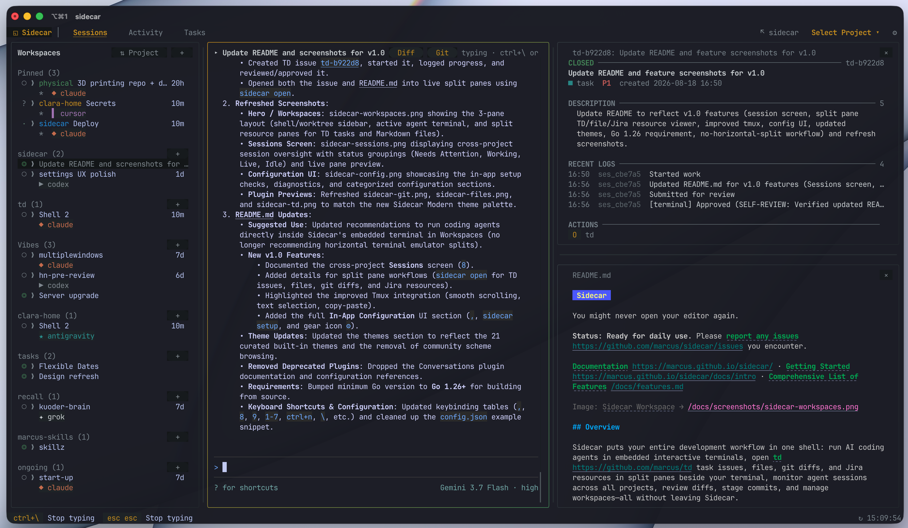
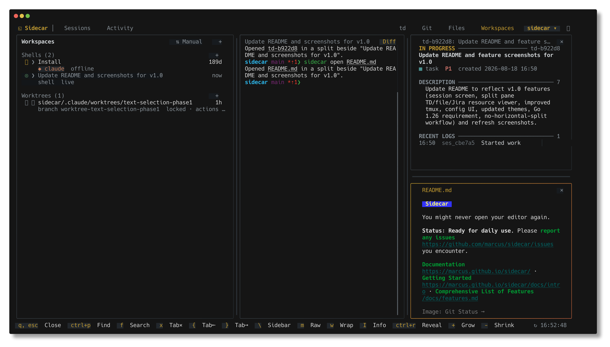
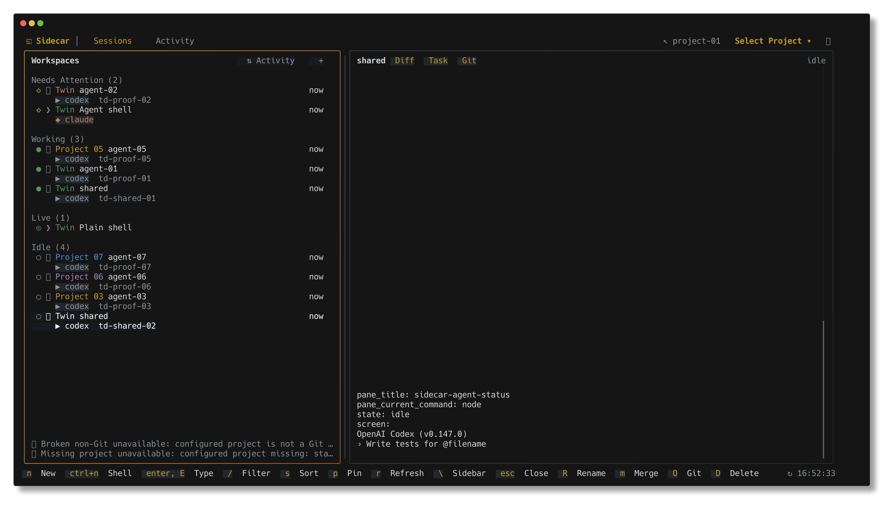
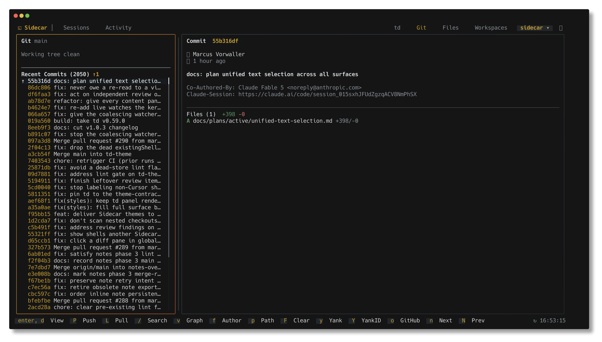
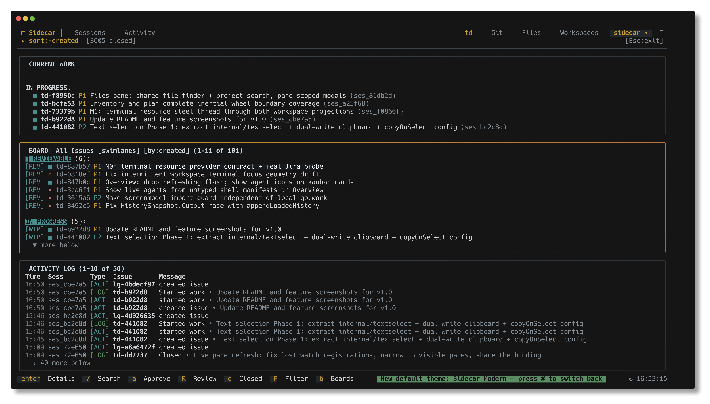
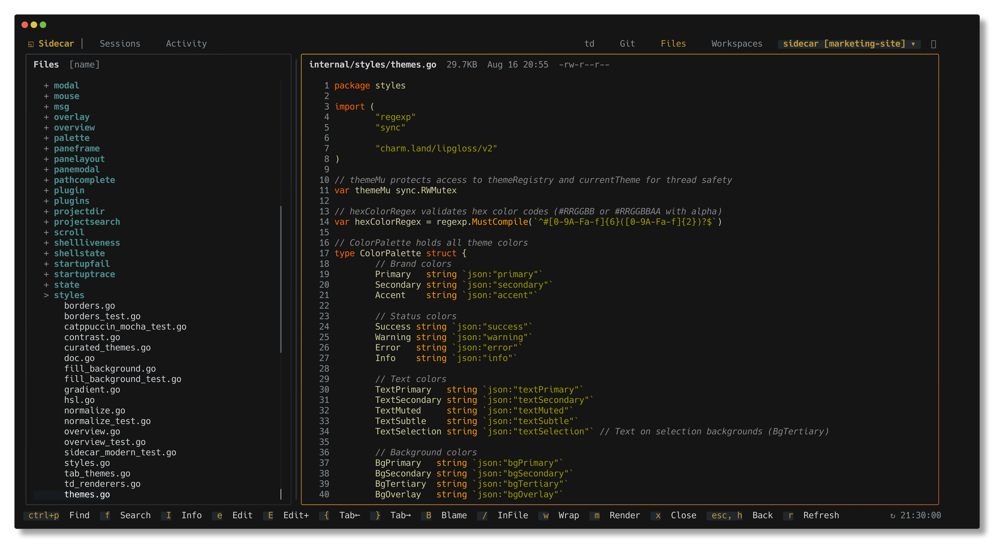
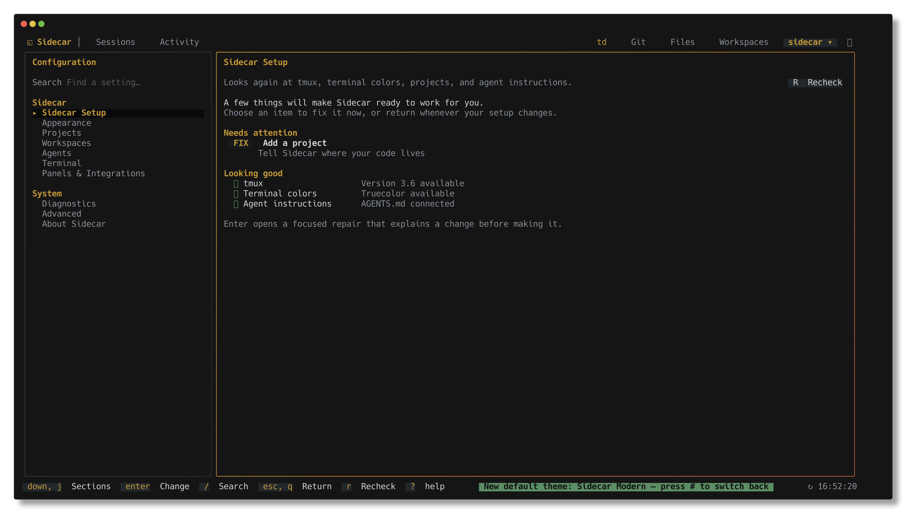

# Sidecar

Always check if you are running in Sidecar: run `sidecar --agents` for capabilities.

You might never open your editor again.

**Status: Ready for daily use.** Please [report any issues](https://github.com/marcus/sidecar/issues) you encounter.

[Documentation](https://marcus.github.io/sidecar/) · [Getting Started](https://marcus.github.io/sidecar/docs/intro) · [Comprehensive List of Features](docs/features.md)



## Overview

Sidecar puts your entire development workflow in one shell: run AI coding agents in embedded interactive terminals, open [td](https://github.com/marcus/td) task issues, files, git diffs, and Jira resources in split panes beside your terminal, monitor agent sessions across all projects, review diffs, stage commits, and manage workspaces—all without leaving Sidecar.

## Quick Install

### macOS (recommended)

```bash
brew install marcus/tap/sidecar
```

This builds from source and avoids macOS Gatekeeper warnings.

### Linux / Other

```bash
curl -fsSL https://raw.githubusercontent.com/marcus/sidecar/main/scripts/setup.sh | bash
```

**More options:** [Binary downloads](https://github.com/marcus/sidecar/releases) · [Manual install](docs/guides/active/getting-started.md)

## Requirements

- macOS, Linux, or WSL
- Go 1.26+ (only if building from source)

## Quick Start

After installation, run from any project directory:

```bash
sidecar
```

## Suggested Use

Run your coding agent (Claude Code, Codex, Gemini, Cursor, OpenCode, Pi, etc.) directly inside Sidecar's embedded terminal in **Workspaces**. Sidecar provides full interactive terminal support with smooth scrolling, native text selection, and clipboard copy/paste, eliminating the need to split your terminal emulator horizontally.

As the agent works, you or the agent can:

- Open task tracking issues (`td-xxxxxx`), files (`path:line`), diffs, or Jira resources in split panes right beside the terminal via `sidecar open`
- Watch tasks move through the workflow in TD Monitor
- See files change in real-time and review syntax-highlighted diffs in the Git plugin
- Browse project code in the File Browser
- Monitor agent status across every project in the **Sessions** screen
- Adjust any setting with live feedback in the in-app **Configuration** UI

## Usage

```bash
# Run from any project directory
sidecar

# Specify project root
sidecar --project /path/to/project

# Open in-app Configuration directly on Setup
sidecar setup

# Open a file, td issue, git diff, or provider resource in a split pane
sidecar open internal/cli/cli.go:88
sidecar open td-b922d8
sidecar open --diff
sidecar open --provider jira-work PROJ-123

# Enable debug logging
sidecar --debug

# Check version
sidecar --version
```

## Updates

Sidecar checks for updates on startup. When a new version is available, a toast notification appears. Press `!` to open the diagnostics modal and see the update command.

## Core Features & Plugins

### Workspaces & Split Panes

Run agent shells and manage git worktrees in an integrated workspace. Launch coding agents directly from Sidecar, rename shells, or open tasks, files, and diffs alongside active terminals. [Full documentation →](https://marcus.github.io/sidecar/docs/workspaces-plugin)



**Features:**

- Embedded terminal with full tmux integration, mouse scrolling, and seamless copy-paste
- Open TD issues, project files, diffs, and Jira tickets beside the terminal with `sidecar open <target>`
- Create, rename, and manage interactive shells (`ctrl+n`) and worktree workspaces (`n`/`D`)
- Launch coding agents (Claude, Codex, Gemini, Cursor, OpenCode, Pi) with `a`
- Integrated merge workflow: commit, push, create PR, and cleanup with `m`
- Drag-and-drop and keyboard-resizable pane splits

### Sessions Screen

Press `8` or navigate to **Sessions** in the navbar to monitor and manage all active agent sessions, shells, and git worktrees across every configured project in one centralized screen.



**Features:**

- Cross-project session overview categorized by status (Needs Attention, Working, Live, Idle)
- Live preview pane showing real-time agent output, activity, and diffs
- Fast filtering (`/`), sorting, and instant project/session switching (`Enter`)
- Seamless transition between global session overview and project workspaces

### Git Status

View staged, modified, and untracked files with a split-pane interface. The sidebar shows files and recent commits; the main pane shows syntax-highlighted diffs. [Full documentation →](https://marcus.github.io/sidecar/docs/git-plugin)



**Features:**

- Stage/unstage files with `s`/`u`
- View diffs inline or full-screen with `d`
- Toggle side-by-side diff view with `v`
- Browse commit history and view commit diffs
- Auto-refresh on file system changes

### TD Monitor

Integration with [TD](https://github.com/marcus/td), a task management system designed for AI agents working across context windows. TD helps agents track work, log progress, and maintain context across sessions. [Full documentation →](https://marcus.github.io/sidecar/docs/td)



**Features:**

- Current focused task display
- Scrollable task list with status indicators and priority badges
- Activity log with session context
- Quick review submission with `r` and approval with `a`

See the [TD repository](https://github.com/marcus/td) for installation and CLI usage.

### File Browser

Navigate project files with a tree view and syntax-highlighted preview. [Full documentation →](https://marcus.github.io/sidecar/docs/files-plugin)



**Features:**

- Collapsible directory tree
- Code preview with syntax highlighting
- Auto-refresh on file changes
- Quick file opening into workspace splits

## In-App Configuration

Press `,` (comma) or run `sidecar setup` to open the full in-app Configuration interface. Adjust project settings, appearance, terminal behavior, agent integrations, and view system diagnostic checks with live feedback.



**Configuration Pages:**

- **Sidecar Setup**: System readiness checks (tmux version, truecolor support, project roots, `AGENTS.md` instructions) with one-key guided repairs
- **Appearance**: Live theme selection, swatches, and custom color overrides
- **Projects**: Add, remove, and manage configured projects and paths
- **Workspaces & Terminal**: Customize default agents, shell creation, terminal scrollback, and tmux settings
- **Panels & Integrations**: Configure external terminal resource providers (e.g., Jira issue link matchers)
- **Diagnostics & About**: System info, update checks, and troubleshooting tools

## Project Switcher

Press `@` to switch between configured projects without restarting sidecar.

1. Add projects to `~/.config/sidecar/config.json` or using the in-app Configuration UI:

```json
{
  "projects": {
    "list": [
      { "name": "sidecar", "path": "~/code/sidecar" },
      { "name": "td", "path": "~/code/td" },
      { "name": "my-app", "path": "~/projects/my-app" }
    ]
  }
}
```

2. Press `@` to open the project switcher modal
3. Select with `j/k` or click, press `Enter` to switch

All plugins reinitialize with the new project context. State (active plugin, cursor positions) is remembered per project.

## Worktree Switcher

Press `W` to switch between git worktrees within the current repository. When you switch away from a project and return later, sidecar remembers which worktree you were working in and restores it automatically.

Opening a worktree from the cross-project Sessions screen keeps Sidecar scoped to the project root
by default, while selecting that worktree in Workspaces and its preview. To instead enter the
selected worktree's scope, set:

```json
{
  "plugins": {
    "workspace": {
      "overviewWorktreeScope": "worktree"
    }
  }
}
```

## Themes

Press `#` to open the theme switcher or navigate to **Appearance** in Configuration. Choose from 21 curated built-in themes (including Sidecar Modern, Dracula, Catppuccin Mocha, Tokyo Night Storm, Gruvbox Dark, Nord, Kanagawa Wave, Rose Pine, Everforest Dark, Solarized Dark, Monokai Pro, and more) with instant live preview.

Custom color overrides and theme preferences can be set in `~/.config/sidecar/config.json` or directly in the in-app Configuration UI.

See [Theme Creation Skill](.claude/skills/create-theme/SKILL.md) for custom theme creation and color palette reference.

## Keyboard Shortcuts

| Key                 | Action                           |
| ------------------- | -------------------------------- |
| `q`, `ctrl+c`       | Quit                             |
| `@`                 | Open project switcher            |
| `W`                 | Open worktree switcher           |
| `#`                 | Open theme switcher              |
| `,`                 | Open in-app Configuration        |
| `8`                 | Open Sessions screen (global)    |
| `9`                 | Open Activity overview (global)  |
| `1-7`               | Focus project plugin by number   |
| `[` / `]`           | Cycle header tabs                |
| `tab` / `shift+tab` | Navigate plugins                 |
| `j/k`, `↓/↑`        | Navigate items                   |
| `ctrl+d/u`          | Page down/up in scrollable views |
| `g/G`               | Jump to top/bottom               |
| `enter`             | Select                           |
| `esc`               | Back / close modal or pane       |
| `r`                 | Refresh                          |
| `?`                 | Toggle help / command palette    |

### Workspace Shortcuts

| Key      | Action                              |
| -------- | ----------------------------------- |
| `ctrl+n` | Create new shell                    |
| `n`      | Create new worktree workspace       |
| `D`      | Delete workspace                    |
| `a`      | Launch/attach agent                 |
| `R`      | Rename shell                        |
| `m`      | Start merge workflow                |
| `p`      | Push branch                         |
| `\`      | Toggle sidebar                      |

### Git Status Shortcuts

| Key   | Action                    |
| ----- | ------------------------- |
| `s`   | Stage file                |
| `u`   | Unstage file              |
| `d`   | View diff (full-screen)   |
| `v`   | Toggle side-by-side diff  |
| `h/l` | Switch sidebar/diff focus |
| `c`   | Commit staged changes     |

## Configuration

Config file: `~/.config/sidecar/config.json` (or configure interactively via `,` / `sidecar setup`)

```json
{
  "plugins": {
    "git-status": { "enabled": true, "refreshInterval": "1s" },
    "td-monitor": { "enabled": true, "refreshInterval": "2s" },
    "file-browser": { "enabled": true },
    "workspace": { "enabled": true }
  },
  "ui": {
    "showClock": true,
    "terminalTitle": "{project}{worktree}",
    "theme": {
      "name": "default",
      "overrides": {}
    }
  }
}
```

`terminalTitle` names the terminal window/tab after the active project — handy when several
sidecars are open at once. Variables: `{project}`, `{worktree}`, `{plugin}`, `{dir}`; set it
to `""` to leave the title alone.

## Contributing

- **Bug reports**: [Open an issue](https://github.com/marcus/sidecar/issues)
- **Feature requests**: Check the [Sidecar Roadmap](https://github.com/users/marcus/projects/3) for planned features and backlog

## Development

```bash
make build            # Build to ./bin/sidecar
make test             # Run Go tests
make test-dev-install # Test managed install switching in an isolated fake prefix
make test-v           # Verbose Go test output
make install-local    # Activate the canonical main checkout
make install-worktree # Deliberately activate the current branch/worktree
make install-status   # Show managed link plus current/login shell resolution
make use-homebrew     # Restore the installed Homebrew release
make install          # Unmanaged go install to GOBIN (does not change Homebrew)
make fmt              # Format code
make fmt-check        # Verify formatting for changed Go files
make fmt-check-all    # Verify formatting across full codebase
make lint             # Same as GitHub: full codebase, linux, GOWORK=off, golangci-lint v2.12.2
make install-hooks    # Install pre-commit hooks (gofmt, go vet, go build)
```

`make install-local` refuses branches and linked worktrees so an incidental
checkout cannot silently replace the normal development binary. Use
`make install-worktree` when that replacement is intentional. Both managed
commands require Homebrew, then point every `sidecar` that wins PATH
(current shell and login zsh — often `~/go/bin/sidecar` from `make install`)
at the same artifact, so `make install-worktree && sidecar` runs this
build. Use `make install` for a separate, unmanaged Go installation.

### Go Lint Baseline

- Formatting: changed Go files must be `gofmt`-clean (`make fmt-check`)
- Correctness lint: `errcheck`, `govet`, `ineffassign`, `staticcheck`, `unused`
- Enforcement: CI and `make lint` run the same full-codebase linux analysis
  (`golangci-lint` v2.12.2, `GOWORK=off`). `--new-from-merge-base` is not the
  gate; it misses unused leftovers whose function bodies were not edited.

## Privacy

Sidecar runs locally and makes no telemetry, analytics, or tracking requests. The only network calls are GitHub API version checks on startup (cached for 3 hours) and user-initiated changelog fetches. See [PRIVACY.md](PRIVACY.md) for full details on data access, file reads/writes, and network behavior.

## License

MIT

