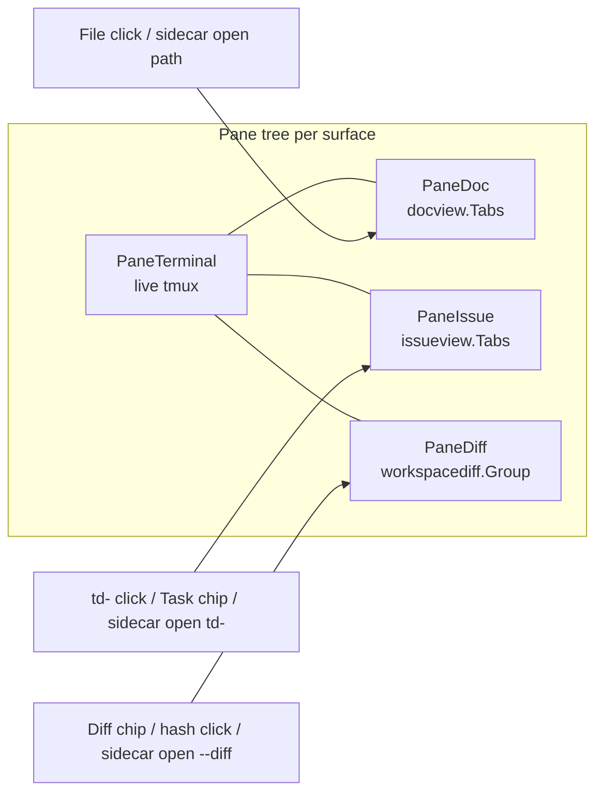

# Diff View as a first-class Sidecar workspace pane

| Field | Value |
| --- | --- |
| Author | Sidecar |
| Date | 2026-08-14 |
| Status | Draft |
| Repository | `/Users/marcus/code/sidecar-diff-panel` |
| Branch | `diff-panel` |
| Surfaces | Project Workspaces TUI, global Workspaces TUI, existing `sidecar open` request bus |

---

## Overview

Sidecar's workspace preview already tiles a live terminal with two *content* leaves — a Files (document) pane and a TD Issues pane — via a shared binary split tree (`internal/panelayout`) and one placement policy (`PlanOpen`). Diff is the missing fourth leaf. Today the worktree mini-diff is a *tab that replaces the tree*, not a pane that sits beside the agent.

This design extracts the existing lightweight worktree/global diff viewer (`internal/workspacediff`) into a real workspace content kind, `PaneDiff`, opened by the same three paths Files and Issues already share: an in-workspace action chip, a clicked terminal span, and `sidecar open`. Worktree Output/Diff/Task tabs go away. Worktree (and shell) terminals become ordinary terminal surfaces with **Diff** and **Task** action chips that insert leaves into the live layout. The full Git Status plugin is left alone.

Sidecar does not own git. The Diff pane is a presentation of `git` output, the same way the Files pane is a presentation of a path and the Issues pane is a presentation of `td show`. Agents get no new "diff CLI product": they get one more target on the request bus they already use.

---

## Background & Motivation

### What exists today

Workspace preview content is three different things stacked on one screen:

| Surface | What the user sees | Implementation |
| --- | --- | --- |
| Project shells | Terminal only (no Output/Diff/Task chips) | `renderPreviewContentLegacy` when `selectingShell()` |
| Project main worktree | Informational view, no chips | `renderMainWorktreeView` |
| Project topic worktrees | Output / Diff / Task *tabs* | `workspacediff.TabsFor` → `TabSetOutputDiffTask` |
| Global shells | Output / Diff chips + a **Git** action chip | `workspacediff.GlobalTabsFor` |
| Global topic worktrees | Output / Diff / Task + Git chip | same |
| Beside any of the above | Files and TD Issues *leaves* in the pane tree | `PaneDoc`, `PaneIssue`, `planPaneOpen` |

The pane tree is already general. `internal/panelayout` is presentation-neutral. Project and global hosts both call `PlanOpen` + `SplitLeaf`, trial the result against floors, and refuse rather than squeeze. Persistence is structural (`state.PaneLayoutJSON` keyed by surface). Document and issue leaves are tab groups (`docview.Tabs`, `issueview.Tabs` wrapping `tabs.Group`) with hide-on-`q` and forget-on-last-`x`.

The mini-diff is *already* a second implementation, extracted once:

- Shared model/load/render: `internal/workspacediff` (`View`, `LoadSnapshot`, `LoadSnapshotPinned`, `Render`).
- Project host still has a parallel renderer and all of the keyboard/mouse: `internal/plugins/workspace/view_diff.go`, `diff.go`, `diff_view.go`, `keys.go` (`handleDiffTab*`), `mouse.go` (`regionDiffTabDivider`).
- Global host holds one `workspacediff.View` per selected row (`overview.ensurePreviewExtras`). Global preview does **not** pass a `Hit` callback, so `RegionDivider` is never registered there.

The full Git plugin (`internal/plugins/gitstatus`) is a different product: stage/unstage, commit, push/pull, stash, branch, discard, history search, GitHub, graph. The workspace viewer imports a few of its parsers (`ParseMultiFileDiff`, `ParseUnifiedDiff`, `BuildFullFileDiff`) and must keep doing that. It must not grow staging or a second Git tab.

### The load-bearing bug: Diff is a tab that *destroys* the layout

```8:10:internal/plugins/workspace/focus.go
func (p *Plugin) paneTreeShowing() bool {
	return p.selectingShell() || p.previewTab == PreviewTabOutput
}
```

On a topic worktree, switching to Diff or Task (`,` / `.` or a chip click) hides the pane tree. Open files and issues disappear. The terminal is no longer a leaf; the mini-diff owns the whole preview. Overview does the same in `renderPreviewWithTabs` when `previewTab != TabOutput`. That is why the product asks for buttons that "do not navigate the user away" and why `,`/`.` on worktrees is the wrong model once Diff is a leaf.

The steel-thread tests in `pane_placement_test.go` already describe the *desired* world for files and issues: a full-height terminal column, content stacked on the right, same-kind clicks retargeting a tab group. Diff is not in that world yet.

### Pain points

1. **Diff and the agent cannot be on screen together** on a topic worktree. The tab replaces the tree.
2. **Two renderers, one name.** `view_diff.go` and `workspacediff.Render` will drift. Global cannot drag-resize or page the way the project tab can.
3. **`d` is a dead binding.** `internal/keymap/bindings.go` maps `d` → `show-diff` in `workspace-list`, but `handleListKeys` has no `"d"` arm and `Commands()` does not advertise it. The keyboard-skill Workspaces list table does **not** list `d`; PR 2 adds it.
4. **Agents cannot put a diff in front of the user.** `sidecar open` already opens files and `td-` ids over `internal/uirequest`. There is no `TargetKind` for a git object.
5. **Hashes in session output are dead text.** Files and `td-` ids are OSC-8 / hit-tested spans (`internal/terminallink`). Commit SHAs and `A..B` ranges are not.
6. **The mini-viewer's height math is plugin-global.** `handleDiffTabDiffPaneKey` pages with `p.height - 6` and a hardcoded 10-line step, not the leaf's allocated box (the defect `td-331dbf19` addressed for other diffs).
7. **Focus context is wrong for a pane.** While the Diff tab is up, `FocusContext()` is `workspace-preview`, a *root* context (`isRootContext` in `internal/app/update.go`). `q` quits Sidecar. Files and issues already have non-root contexts (`workspace-doc`, `workspace-issue`) where `q` hides the leaf.
8. **Every sidebar move runs `git`.** `loadSelectedContent` always calls `loadSelectedDiff()` (`plugin.go:2044-2047`), even when the Diff tab is not showing. That is the CrowdStrike tax, not `Init`/`Start`.

---

## Goals & Non-Goals

### Goals

1. Extract the worktree/global mini-diff into one reusable component that is a first-class workspace leaf, identical in lifecycle to Files and Issues: open, focus, hide, restore, close, tab-append, trial-layout refuse.
2. Remove the Output/Diff/Task tab row. Worktree terminals behave like shell terminals: output is the surface.
3. Keep a **Diff** action chip on worktree (and shell) headers that inserts a Diff leaf. Keep a **Task** action chip when a worktree has a linked `TaskID`, inserting that id into the existing Issues leaf via `openIssuePaneForSurface`.
4. Clickable git object spans in terminal output open the Diff leaf, using the same host activation path as file and issue spans.
5. Extend `sidecar open` (and only that) so an agent can request a Diff leaf against the calling shell. No new binary, no MCP, no Sidecar-owned git store.
6. One placement policy for Diff, File, and Issue opens. Specify the algorithm, including the third-pane case, and be honest about what `PlanOpen` already does.
7. While extracting, fix the mini-viewer's real defects: host-owned divider drag registered from the leaf box, height-aware paging, epoch/workspace-id stale-data, focus context + footer commands, keyboard/mouse parity, and stop preloading `git` on every selection.

### Non-Goals

- Rebuilding or forking the Git Status plugin. No staging, commit editor, push/pull, stash, branch picker, or GitHub from the Diff leaf. The existing **Git** chip / `O` (`open-in-git`) remains the jump into that plugin.
- A new Sidecar "diff CLI" beyond `sidecar open` target kinds.
- A second live terminal, floating panes, or the rest of `docs/plans/active/workspace-windowing-system.md`.
- Persisting diff *bodies*. Persist the target spec (working-tree / commit / range) and reload, the way issue tabs persist an id and re-fetch.
- Making Sidecar the source of truth for git objects or td tasks.
- Changing the default tmux server, or writing proof runs into `~/.local/state/sidecar`.
- A second overlay Diff UI when `workspace_doc_panes` is off. After tab removal, no pane tree means no Diff (changelog + toast/no-op). Do not keep the old tab body as a fallback.
- A pending-open *queue*. The existing last-write-wins one-slot `pendingViews[tmuxName]` stays for all kinds.

---

## Proposed Design

### 1. Mental model

Four leaf kinds, one tree, one planner:



A *surface* is still `shell:<tmuxName>` or `workspace:<worktreeKey>`. Content leaves bind to that surface and collapse when selection moves, exactly as documents and issues do today (`selectedTerminalSurface`, `contentLeafSurface`).

There is still **at most one leaf per content kind per surface**. A second Diff open retargets the existing leaf and appends or focuses a tab. That is the file/issue rule (`PlanOpen` retarget + `OpenOrFocus`) and it is what keeps the tree at four leaves max.

### 2. Component extraction

Promote `internal/workspacediff.View` from "a snapshot + a renderer the global preview happens to call" to the component both hosts embed. The project plugin's `asDiffView` / `fromDiffView` copy is a seam that must disappear: the leaf *holds* a `View` (via `Group`), it does not project one.

```
internal/workspacediff/
  types.go          Snapshot, File, CommitInfo, Focus, Scope, ViewMode, LoadState
  snapshot.go       LoadSnapshot / LoadSnapshotPinned (unchanged contract)
  view.go           cursor, scope apply, commit-detail load, stale-safe Apply*
  render.go         two-pane + collapsed + aggregate; height-clamped
  target.go         Target spec, parse, identity, tab label
  group.go          Group wrapping tabs.Group[*View], key = Target.Identity()
  keys.go           HandleKey — today's handleDiffTab* moved here
  layout.go         DividerHit / ApplyListWidthDelta / ListWidth / file-row hits
  paging.go         page step = max(1, allocatedHeight/2), clamp to content
  tabs.go           Output/Diff/Task chip helpers (Tab / TabSet); deleted in PR 7
  task.go           Task tab renderer; deleted in PR 7
```

**Law.** `workspacediff` must not import `workspace` or `overview`. It may import `gitstatus` parsers/render helpers, `styles`, `ui`, `mouse` types, `tabs`, and `tea`. Hosts adapt it to `workspace.Content` / the global preview compositor.

#### Target spec

```go
// internal/workspacediff/target.go
type TargetKind int

const (
    TargetWorkingTree TargetKind = iota // git diff HEAD + untracked; Identity "wt"
    TargetCommit                        // one commit as the root view
    TargetRange                         // git diff A..B or A...B
)

type Target struct {
    Kind     TargetKind
    A        string // resolved left rev; empty for working-tree
    B        string // resolved right rev for ranges
    Dots     string // ".." or "..." for ranges; empty otherwise
    Path     string // optional file to select once the load lands
}

func (t Target) Identity() string
func ParseSpec(raw string) (Target, bool)
func ResolveSpec(ctx context.Context, workdir string, t Target) (Target, error)
```

`Identity()` is the stable tab key and the only string that crosses the request bus:

| Target | Identity() | Never |
| --- | --- | --- |
| Working tree | `wt` | `"HEAD"`, empty, `"c:HEAD"` |
| Commit | `c:<resolved>` | the working-tree snapshot |
| Two-dot range | `r:<A>..<B>` | collapsed to `r:<A>...<B>` |
| Three-dot range | `r:<A>...<B>` | collapsed to two-dot |

`ParseSpec` accepts user-facing forms (`abc1234`, `abc1234..def5678`, `commit abc1234`, `HEAD~3`) **and** Identity forms (`wt`, `c:…`, `r:…`). `ResolveSpec` runs `git rev-parse --verify --quiet <rev>^{commit}` in `workdir` and fills `A`/`B` with the resolved object name. Working-tree (`wt`) does not rev-parse. `--diff HEAD` is `TargetCommit` after rev-parse, **not** working-tree.

#### Per-target view / load model

Today `View` is one snapshot: working-tree files + unique-commits list + optional commit-detail *drill*. Hash clicks and `sidecar open abc1234` / `A..B` are **new tabs**, each with its own `View`. They are not a cursor position on the working-tree tab.

| | Working-tree tab (`wt`) | Commit tab (`c:<rev>`) | Range tab (`r:<A>..<B>` / `r:<A>...<B>`) |
| --- | --- | --- | --- |
| Git | today's `LoadSnapshotPinned`: `git diff --binary <HEAD>`, untracked synth, `git log <base>..<HEAD>`, `git diff <merge-base>..<HEAD>` | `git show --format=%H%n%h%n%s -s <rev>` + `git show --numstat --format= <rev>` (today's `LoadCommitDetail`); file patch via today's `loadCommitFileDiff` | `git diff --binary <A>..<B>` or `git diff --binary <A>...<B>` (operator from `Dots`). No `git log` |
| `View` fields | `Snapshot`, `Files`, `Commits`, optional `CommitDetail` drill | `CommitDetail` is the **root** (not a drill). No `Snapshot`, no `Commits` list | `Files` from `ParseMultiFileDiff` / `ParseFiles` of the range patch. No `Snapshot.Commits`, no `CommitDetail` |
| `Render` chrome | `Working Tree vs HEAD (N)` + commits section (today) | `Commit <hash> <subject>` — never "Working Tree vs HEAD" | `<A>..<B>` or `<A>...<B>` — file list only, no commits section |
| Load cmd | `LoadSnapshotCmd` (existing) | `LoadCommitCmd` — wraps `LoadCommitDetail`; does **not** call `LoadSnapshot` | `LoadRangeCmd` — one `git diff` |
| Apply msg | `SnapshotMsg{Epoch, WorkspaceID, Identity: "wt", Snapshot}` | `CommitDetailMsg{Epoch, WorkspaceID, Identity: "c:<rev>", Commit}` | `RangeMsg{Epoch, WorkspaceID, Identity, Files/Raw}` |
| `z` scope | yes — working-tree / commits / aggregate | **no-op** | **no-op** |
| `v` view mode | unified / side-by-side / full-file on the selected file | same, on a commit file | same, on a range file |
| `{` / `}` | next/prev **file** in this tab's list (today) | next/prev file in the commit | next/prev file in the range |
| Cursor on a commit in the wt list | still a *drill* inside the `wt` tab (`FocusCommitFiles`). Does **not** create a `c:` tab | n/a | n/a |

Apply functions drop a message when `Epoch`, `WorkspaceID`, or `Identity()` mismatch the tab that asked, the way `applyIssueLoaded` routes by model ID.

A hash click or `sidecar open abc1234` opens (or focuses) a `c:` tab. Selecting a commit row inside the working-tree tab still drills in place. Those are different journeys.

#### View API

```go
func (v *View) SetSize(width, height int)
func (v *View) HandleKey(msg tea.KeyPressMsg) (tea.Cmd, bool)
func (v *View) Commands(context string) []plugin.Command
func (v *View) ListWidth() int
func (v *View) ApplyListWidthDelta(dx, leafWidth int) int // clamp min 20 / max leafWidth-30; return new width
func (v *View) DividerHit(leaf mouse.Rect) mouse.Rect     // 3-col hit, plugin-local, leaf box only
func (v *View) FileHits(leaf mouse.Rect) []Hit            // per-row file/commit hits inside the leaf
```

`View` does **not** own a `HitMap` or `StartDrag`. See §8.

Load stays a `tea.Cmd`. `Init`/`Start` of the workspace plugin already do not walk git; they must not start doing so. A Diff tab that is created paints `LoadStateLoading` and fires the cmd for its `TargetKind`.

Reuse, do not rewrite:

| Capability | Keep using | Do not copy into workspacediff |
| --- | --- | --- |
| Unified / side-by-side / full-file parse | `gitstatus.ParseUnifiedDiff`, `ParseMultiFileDiff`, `BuildFullFileDiff` | a third parser |
| Working-tree + untracked snapshot | `workspacediff.LoadSnapshotPinned` | `gitstatus.GetFullDiff` |
| Commit file list | `LoadCommitDetail` (already in `view.go`) | `gitstatus` history sidebar |
| Syntax colors | `gitstatus` highlight helpers if a call is cheap | a new highlighter |

### 3. Pane type and host wiring

Add a fourth kind next to the three that already exist:

```go
// internal/panelayout/panelayout.go
const (
    Terminal Kind = iota
    Document
    Issue
    Diff        // NEW
)

// internal/plugins/workspace/content.go
const contentKindDiff = "diff"
```

`Floors` grows a `Diff` field. `paneMinimum` grows a `case Diff:` arm that uses `floors.Diff` — without it, Diff leaves inherit the **terminal** floor (`termPanelMinBoxCols` = 10), not the document floor. Set `Floors.Diff` to the same numbers as a document (`markdown.MinWidthForMarkdown` = 30 cols, `termPanelMinBoxRows` = 3) in **both** `paneTreeFloors()` and overview `previewPaneFloors()`. A Diff leaf is a two-pane viewer that already collapses below 120 cols (`CollapseThreshold`); the *tree* floor is the leaf's box, not the internal list+diff split.

#### `workspacediff.Group`

`tabs.go` already exports `Tab` / `TabSet` / `TabsFor` (Output/Diff/Task **chips**). Do not reuse that name for the target group.

```go
// internal/workspacediff/group.go
// Group is one Diff leaf's open targets. The pane tree points at this,
// not at one View. Key = Target.Identity().
type Group struct {
    tabs.Group[*View]
}

func (g Group) ActiveView() *View
func (g Group) Find(id string) int
func (g *Group) OpenOrFocus(t Target, view *View) (index int, created bool)
```

API is cloned from `issueview.Tabs` (`OpenOrFocus`, `Find`, `ActiveView`, `Cycle`, `CloseActive` via `tabs.Group`). Chip helpers stay named `TabSet` until PR 7 deletes them.

Project host, mirroring `docPane` / `issuePane`:

```go
type diffPane struct {
    leafID  int
    root    string
    surface string
    tabs    workspacediff.Group
}

func (p *Plugin) openDiffPaneForSurface(root, surface string, target workspacediff.Target) tea.Cmd
```

The body of `openDiffPaneForSurface` is a clone of `openIssuePaneForSurface` (`issue_panes.go:67-119`):

1. Force the tree on screen: `p.previewTab = PreviewTabOutput` (project) / `m.previewTab = workspacediff.TabOutput` (global). This is **not** "navigate to the Diff tab"; it is the only way `paneTreeShowing()` draws the leaf. Required for the entire dual-UX window (PRs 2–6). Applies to **every** content-leaf open (File, Issue, Diff) so a user sitting on the Diff tab who clicks a file or presses `d` actually sees the tree.
2. `reopenHiddenDiffPane()` if the surface hid a remembered set.
3. `plan, ok := planPaneOpen(p.paneRoot, PaneDiff, p.lastPaneBoxes())`.
4. Retarget → `attachDiffPane` (`Group.OpenOrFocus`) → `paneFocus = leaf` → `saveSelectionState`.
5. Else trial `SplitLeaf` on a clone, `LayoutPanes(..., paneTreeFloors())`, toast `paneFitMessage("Diff", axis)` and refuse if `!fits`.
6. Commit the split, attach, `resizeDocTerminalCmd()` so the live tmux pane is told *once*.

Global host: the same `ensurePreviewPane(panelayout.Diff, "Diff")` path `preview_links.go` already uses for documents and issues. `previewPaneCache` grows a `diff *previewDiff` field (today it is `{root, focus, nextID, doc, issue}`). Without that field, cursoring away drops Diff tabs. Global layouts stay memory-only.

`paneContent` **must** grow an explicit `PaneDiff` arm. Today's default is `terminalContent`:

```68:88:internal/plugins/workspace/content.go
func (p *Plugin) paneContent(node *PaneNode) Content {
    // ...
    default:
        return &terminalContent{p: p}
}
```

A Diff leaf that fell through here would draw the terminal twice. Overview `renderOutputPreview` has **no** default terminal — an unhandled `panelayout.Diff` draws a **blank** box. Both hosts need an explicit Diff arm.

`supportedPaneTree` must accept `PaneDiff` or restore will discard the leaf.

Focus ring: once Diff is a tree leaf **and** `previewTab` is Output, Tab walks sidebar → every leaf in placement order → (legacy) terminal panel. Intra-Diff focus (file list ↔ hunk pane) stays `h`/`l`/`enter`/`esc` inside the leaf, never Tab.

#### Host checklist (clone `issue_panes.go` + `handleIssueKey`)

An engineer implementing PR 2 must touch all of these. Missing any one of them is a shipped bug:

| Hook | Project | Overview |
| --- | --- | --- |
| `openDiffPaneForSurface` / `openPreviewDiff` | new, clone issue open | new, via `ensurePreviewPane(Diff)` |
| Force `previewTab = Output` on every content-leaf open | `openDoc` / `openIssue` / `openDiff` | same |
| `handleDiffKey` in `handleListKeys` **before** the list switch | after `handleIssueKey` (`keys.go:584-592`) | equivalent in overview key path |
| `FocusContext()` / `WorkspaceFocusContext()` returns `workspace-diff` / `global-workspaces-diff` when the focused leaf is Diff | `commands.go:428-445` | `overview/workspaces.go:502-518` |
| Do **not** add those names to `isRootContext` | default-false switch (`app/update.go:1740-1759`) | `global-workspaces-diff` is not root; `q` hides |
| `Commands()` advertises `show-diff` on `workspace-list` **and** `workspace-preview` | footer/palette | `d` on global list if we bind it; otherwise chip-only |
| `encodePaneNode` `contentKindDiff` arm | today anything not terminal/issue encodes as a **doc** (`doc_panes.go:1266-1281`) | n/a (memory-only) |
| `decodePaneNode` + `decodeDiffLeaf` | unknown kind returns nil; sibling kept | n/a |
| `supportedPaneTree` accepts `PaneDiff` | yes | n/a |
| `paneMinimum` / `Floors.Diff` | `paneTreeFloors` | `previewPaneFloors` |
| `paneContent` / compositor switch | explicit Diff, not default terminal | explicit Diff, not blank |
| `previewPaneCache.diff` | n/a | grow the struct |
| `registerPaneLeafRegions` last-pass divider | §8 | same |
| Skill table | add `d` / Diff to Workspaces list + preview rows | add Diff chip / `global-workspaces-diff` keys |

### 4. Action chips replace tabs

Precedent already exists: the global **Git** chip is "a jump, not a tab" (`overview/preview_tabs.go`, `previewGitHit`). Diff and Task become the same kind of chip.

```mermaid
sequenceDiagram
    participant User
    participant Header as Terminal header chips
    participant Tree as pane tree
    participant Diff as workspacediff.View
    participant Issue as issueview.Model

    User->>Header: click Diff
    Header->>Tree: previewTab=Output then openDiffPaneForSurface(root, surface, TargetWorkingTree)
    Tree->>Diff: LoadSnapshotCmd (tea.Cmd, after first frame)
    Note over Tree: terminal stays a leaf; files/issues stay

    User->>Header: click Task (only if TaskID != "")
    Header->>Tree: previewTab=Output then openIssuePaneForSurface(root, surface, wt.TaskID)
    Tree->>Issue: existing fetch
```

Chip rules:

| Chip | When drawn | Click | Must not |
| --- | --- | --- | --- |
| **Diff** | Every surface that has a checkout: topic worktrees, **main worktree**, project shells, global shells | force Output, then `openDiffPaneForSurface(..., TargetWorkingTree)` | start typing; set `previewTab` to Diff; hide the tree |
| **Task** | `wt.TaskID != ""` only (project and global topic worktrees) | force Output, then `openIssuePaneForSurface(..., wt.TaskID)` | open the old `RenderTask` summary; navigate to the TD plugin |
| **Git** | unchanged (`canOpenInGit` / `openInGitTab`) | jump to Git Status at that checkout | become a Diff leaf |

**Main worktree gets a Diff chip.** Today `TabsFor(isMain)` is `TabSetNone` and `renderMainWorktreeView` is tabless. That is a product change: the informational body stays until the user opens a leaf; the chip is how they open one. Same for shells (project shells have no Diff tab today; they get the chip).

Keyboard: wire the existing dead binding. `d` in `workspace-list` and `workspace-preview` calls the same `openDiffPaneForSurface` as the chip. Do **not** add a new key. Add `d` / `show-diff` to the keyboard-skill Workspaces list and preview rows in PR 2. `T` stays link/unlink (`link-task`). There is no new "open task" key; the chip, a `td-` click, and `sidecar open td-…` are the three paths, matching Files.

Chip rendering uses `styles.RenderPillWithStyle` (`ui-features` skill). Register hit regions last, from the same `layoutHeaderChips` placement that draws them (`registerPreviewTabRegions` is the template; rename to `registerPreviewActionRegions` in PR 7).

When `workspace_doc_panes` is off, `paneRoot` is nil. During PRs 2–6 the old Diff **tab** still works. After PR 7 the tab is gone: `d`, the Diff chip, hash clicks (nil resolver), and `sidecar open --diff` **toast or no-op** (`"Document panes are disabled; Diff needs the workspace pane tree"`). Put that sentence in the PR 7 changelog and in `--disable-feature=workspace_doc_panes` help. Do not keep a second overlay UI.

### 5. Clickable hashes

Extend `internal/terminallink` analogously to files and issues. Scan order stays first-kind-wins:

1. URL
2. `path:line`
3. existence-gated bare file
4. `td-[0-9a-f]{4,}` (already whole-token)
5. **NEW** existence-gated git spec, scanned in this intra-kind order:
   1. `dotted` (`rev (".." \| "...") rev`)
   2. `commitword` (`commit` WS `rev`)
   3. `rev`
   Reuse `overlaps` so `abc1234..def5678` is one span, not two `rev`s plus a range.

#### Grammar

Agents actually print, in this repo and in everyday `git log --oneline` / review notes:

- 7–16 lowercase hex (`abc1234`, `abc1234def`)
- 40-hex SHA-1, 64-hex SHA-256
- `commit abc1234`
- `abc1234..def5678` and `abc1234...def5678`
- sometimes `HEAD`, `HEAD~3`, `HEAD^` next to a verb ("diff against HEAD~3")

They also print things that must **not** become links:

- `td-a1b2c3` (already an issue)
- `deadbeef.go`, `abc1234.txt`, `README.md`
- hex inside a URL
- 1–6 hex (`d`, `cafe`, `filter`)
- mixed-case hex (`Abc1234`, `DEADBEE`) — scanner is **`[0-9a-f]` only**, no case fold. Git's default `%h` is lowercase. An agent that wants `HEAD` uses `sidecar open --diff HEAD`.
- bare `main` / `master` / `origin/main` (too noisy; an agent that wants a branch uses `sidecar open --diff origin/main`)

Concrete tokens, after ANSI strip:

```
rev        := [0-9a-f]{7,64}          # lowercase only
dotted     := rev (".." | "...") rev
commitword := "commit" WS rev
spec       := dotted | commitword | rev
```

Whole-token boundaries use the same idea as `issueTokenWhole`: a match that sits inside a longer path/filename token (`abc1234.go`, `foo/abc1234`) is dropped even if no file span claimed it.

A `DiffResolver` (same shape as the file resolver) is *required* for hashes. The host runs, in the selected checkout:

```
git rev-parse --verify --quiet <token>^{commit}     # single rev
git rev-parse --verify --quiet <A>^{commit} &&
  git rev-parse --verify --quiet <B>^{commit}       # range
```

`ok=false` drops the span. No underline that cannot activate.

Memo: host `terminalLinkMemo` grows a sibling `specs map[string]terminalLinkResolution`. Do **not** reuse `paths`. Key is the raw token; invalidate with the same `(surface, buffer, revision)` rule as files.

First-paint budget: a `git log` dump can still miss the cache once per unique token. Cap **new** `rev-parse` calls per buffer revision (16 is enough for a typical oneline screen; further unique tokens stay plain text until the next revision, when the next 16 resolve). Never spawn unbounded `git` from `View()`.

`HEAD` / `HEAD~N` / `HEAD^` / branch names are accepted **only** by `sidecar open --diff <spec>`, not by the scanner.

Activation opens `TargetCommit` or `TargetRange` on the Diff leaf (and forces Output). A working-tree chip / `d` is `TargetWorkingTree`. Selecting a file path inside the Diff leaf is in-leaf navigation, not a new Files pane (unless the user then clicks that path in the *terminal*).

Nil resolver when `paneRoot == nil` — same rule `activatableTerminalLinks` uses to hide issue spans when there is no tree.

### 6. CLI / agent path

`sidecar open` already exists (`internal/cli/open.go`, registry in `internal/cli/registry.go`, bus in `internal/uirequest`). Hosts already consume `ActionOpen` in `workspace/ui_requests.go` and `overview/ui_requests.go`. The agent never moves selection; unselected shells queue a **single** pending target (`pendingViews[tmuxName] = …` overwrites). This design does **not** grow that into a queue. Three `sidecar open --diff <hash>` while the user is away leave **one** pending target — the last hash — which opens as one Diff tab when they select the shell.

Add one target kind and one **boolean** flag. Do not add `sidecar diff`. Do not add `uirequest.Target.Spec`.

```
sidecar open --diff                 # working tree (Value "wt")
sidecar open --diff HEAD            # TargetCommit after rev-parse (Value "c:<oid>")
sidecar open --diff HEAD~3          # TargetCommit, even if the spec is not hex
sidecar open abc1234                # commit, if it resolves and is not a file
sidecar open abc1234..def5678       # range (Value "r:<A>..<B>")
sidecar open td-348d88              # unchanged
sidecar open internal/cli/cli.go    # unchanged; a real file wins over a hash
```

Parser (`runOpen`):

- `--diff` is a bool flag (not `--diff <spec>`; that fights `--split`).
- Positional min = 0 **iff** `--diff`; otherwise exactly one target.
- `ResolveTarget(workDir, raw, line, opts)` grows `opts.Diff bool` (or a small options struct). Today's `len(positional) != 1` hard-fail is wrong for `sidecar open --diff`.

Classification, in order:

1. `terminallink.IssueID(raw)` → `TargetKindIssue`. (`--diff td-…` is still an issue; do not rev-parse it.)
2. `--diff` and no positional → `TargetKindDiff`, `Value = "wt"`.
3. `--diff` and a positional → parse as a git spec (including `HEAD`, `HEAD~N`, branches). `ResolveSpec` in `origin.WorkDir`. Unknown rev → exit 2. `Value = Identity()`.
4. Existing file path logic. A file named `abc1234` that exists as a regular file inside the workspace root is `TargetKindFile`. A **missing** file is **not** yet a hard error.
5. Else if `ParseSpec(raw)` and `ResolveSpec(workDir, spec)` succeed → `TargetKindDiff`, `Value = Identity()`.
6. Else usage error (this is where a missing file that is not a git object finally fails, exit 2).

#### `uirequest.Target` → `workspacediff.Target`

Do not add a `Spec` field. `Target` stays `{Kind, Value, Line}`. `Line` is unused for diffs.

| Invocation | `uirequest.Target` | `workspacediff.Target` after `ParseSpec(Value)` |
| --- | --- | --- |
| `sidecar open --diff` | `{Kind: "diff", Value: "wt"}` | `TargetWorkingTree` |
| `sidecar open --diff HEAD` | `{Kind: "diff", Value: "c:<oid>"}` | `TargetCommit{A: oid}` |
| `sidecar open --diff abc..def` | `{Kind: "diff", Value: "r:<A>..<B>"}` | `TargetRange{A, B, Dots: ".."}` |
| `sidecar open --diff abc...def` | `{Kind: "diff", Value: "r:<A>...<B>"}` | `TargetRange{…, Dots: "..."}` |
| Diff chip / `d` | (no request) | `TargetWorkingTree` directly |

Hosts switch on `req.Target.Kind` and call `ParseSpec(req.Target.Value)` then `openDiffPaneForSurface` / `openPreviewDiff`. The load-bearing test: a synthetic hash click and a `sidecar open abc1234` for the same object produce **identical pane trees**.

#### `--split` is an axis override only

`--split auto|right|below` is accepted today and **ignored** by both hosts. This work honors it as follows — and **only** as follows:

| Value | Meaning |
| --- | --- |
| `auto` (default) | `PlanOpen` unchanged |
| `right` | run `PlanOpen`, then if the plan is a split (not a retarget), set `plan.Axis = Columns`. The **leaf** `PlanOpen` named is unchanged |
| `below` | same, `plan.Axis = Rows` |

Consequences, written down so they cannot drift:

- Retarget is still retarget. `--split` never forces a second leaf of a kind that already exists.
- After File+Issue are on the right, `PlanOpen` names a **content** leaf. `--split below` stacks more content. It does **not** split the live terminal. It does **not** SIGWINCH the agent.
- `--split` never retargets the split leaf just to reach the terminal.
- There is no CLI hatch that halves a live agent. If product later wants one, that is a new flag and a new test that the terminal box **does** change height. This design does not include it.

A declined split still acks `declined` and exits 4. Queued opens still do not steal focus.

`sidecar --agents` / the generated `docs/reference/cli.md` / `AGENTS.md` CLI section all come from the registry. Update the `open` command's `Targets` (add `--diff`, `wt` / spec), `Flags` (`--diff` bool), `Args` (min 0 iff `--diff`), `Examples`, and `Agent` blurb once. Gendoc drift test updates in the same PR.

### 7. Placement algorithm

#### What `PlanOpen` does today

```146:163:internal/panelayout/panelayout.go
// PlanOpen keeps the terminal in a full-height left column: the first content
// opens beside it, a different content kind stacks in the right column, and a
// repeated kind retargets its existing leaf.
func PlanOpen(root *Node, kind Kind) (OpenPlan, bool) { /* ... */ }
```

Mapped onto the product's bullets:

| Product rule | Today | Notes |
| --- | --- | --- |
| Single terminal → split to the right | **Already implemented** | `Split: terminal, Axis: Columns`. Tests: `TestPlanPaneOpenPlacesClickedContentByTheDefaultHeuristic`, `TestClickingATdIssueWithNoDocumentSplitsTheTerminal` |
| Right side already open → prefer splitting the right side | **Already implemented** | `firstContent` + `Rows`. Tests: `TestClickingAFileThenATdIssueBuildsTheSteelThread`, `TestClickingATdIssueThenAFileStacksTheRightColumn` |
| Same kind again → do not split | **Already implemented** (and stricter than "duplicate-open") | Retarget + tab. A second `td-` or file never grows the tree |
| Right side already two (Issue + Files) → split the *left* top/bottom | **Not implemented** | There is no third content kind, so this case cannot happen yet. Today's code would `Rows`-split `firstContent` (the top-right leaf), producing `Terminal \| ((Doc/New) / Issue)` |

#### Decision: do not auto-split the live terminal after the first content open

The product's third bullet ("split the left pane") fights a contract this repo already tests and a law the windowing plan already wrote down:

- Steel-thread tests require `boxes[PaneTerminal].H == content.H` (full-height left column) after *two* content opens.
- A live leaf is a tmux pane. Splitting it is a SIGWINCH into the agent (`docTerminalResizeCmds`).
- `PlanOpen`'s own comment states the invariant: *"keeps the terminal in a full-height left column."*

**Auto placement therefore keeps that invariant.** A third *kind* splits the **largest content leaf** on the right, `Rows`, new leaf as `B` (below). The terminal's box does not move. `--split` cannot override that leaf (axis only; see §6).

#### Signature change (PR 6)

Today `PlanOpen` is a pure tree walk. It cannot see areas. Geometry is a new argument:

```go
func PlanOpen(root *Node, kind Kind, boxes map[int]Box) (OpenPlan, bool)
```

`planPaneOpen` in workspace and the overview wrapper pass the last **non-zoomed** `LayoutPanes` result (the same box they trial against). A zoomed `LayoutTree` (one leaf, full box) is not a source of areas — hosts must not pass it.

```
PlanOpen(root, kind, boxes):
  if kind == Terminal: refuse
  if FirstOfKind(kind): retarget that leaf
  contents = non-terminal leaves
  terminal = FirstOfKind(Terminal)
  if len(contents) == 0 && terminal != nil:
      return Split(terminal, Columns)
  if len(contents) == 1:
      return Split(contents[0], Rows)
  if len(contents) >= 2:
      return Split(largestContentLeaf(root, boxes), Rows)
  refuse
```

`largestContentLeaf`:

- Area = `boxes[id].W * boxes[id].H` for each content leaf present in `boxes`.
- Winner is max area.
- **Ties and missing boxes:** DFS-A (`firstContent`) wins. That is today's walk, so a host that passes `nil` boxes behaves exactly as `PlanOpen` does now for the first two content kinds.
- Never pick the terminal.

#### Edge cases

| State | Open File / Issue / Diff | Result |
| --- | --- | --- |
| 0 leaves / nil root | any | refuse (`PlanOpen` false). Hosts reset to a terminal leaf in `resetPaneTreeToTerminal` |
| 1 leaf, terminal | new kind | `Columns`, 50/50, focus new leaf |
| 1 leaf, content only (shouldn't happen) | new other kind | `Rows` on that content if we ever see it; decoder still requires exactly one terminal |
| Terminal \| Doc | Issue or Diff | `Rows` on Doc → `Terminal \| (Doc / New)` |
| Terminal \| Issue | Doc or Diff | `Rows` on Issue |
| Terminal \| (Doc / Issue), equal 50/50 | Diff | `Rows` on DFS-A content (the top-right leaf, usually Doc). Terminal box unchanged |
| Terminal \| (Doc / Issue), user dragged Doc larger | Diff | `Rows` on Doc |
| Any tree, kind already present | same kind | retarget; tab open-or-focus; focus that leaf |
| `--split below` on Terminal \| (Doc / Issue) | Diff | `Rows` on the same content leaf `PlanOpen` named — **not** the terminal |
| Trial layout `!fits` | any new split | no mutation, toast `"Diff pane needs a wider/taller window; layout left unchanged"`, ack `declined` |
| Window shrink after a valid tree | — | `LayoutTree` zooms the focused leaf; the tree is not destroyed (existing) |
| Close the only content leaf | — | `ClosePane` promotes the sibling; typically back to a bare terminal |
| Close one of two stacked contents | — | right column becomes the remaining leaf; next new kind `Rows` on it |
| Hide (`q`/`esc`) | — | tree collapses to terminal; tabs remembered on `hiddenPaneLayout` (`Open: false`). Next open of that kind reinserts |
| Last `x` | — | forget that kind's tabs; `ForgetPaneLayouts` only if no other content remains |
| Duplicate working-tree Diff | — | focus the `wt` tab, reload if stale |
| Duplicate commit / range | — | focus that tab (`Identity` match, including `..` vs `...`); do not refetch if already loaded |
| Max panes | — | 1 terminal + 1 doc + 1 issue + 1 diff = **4 leaves**. Further opens only retarget. No fifth kind |
| Project vs global | — | same `PlanOpen`. Global does not persist the tree |
| `workspace_doc_panes` off, PRs 2–6 | Diff tab | old tab body still works; leaf paths no-op (`paneRoot == nil`) |
| `workspace_doc_panes` off, after PR 7 | any Diff path | toast / no-op / declined ack. No overlay UI |

Focus after insert: the new or retargeted leaf (`SplitLeaf` already returns `firstLeaf(newLeaf).ID`; retarget sets `paneFocus = leaf.ID`). `activePane = PanePreview`. The user is looking at the thing they opened. The agent-driven CLI still does **not** change *which shell is selected*; it only focuses a leaf *inside* an already-selected surface.

Split ratios persist in `PaneSplitJSON.Ratio` (15–85 clamp). Diff's *internal* list/diff divider is a separate pixel width, `state.DiffTabFileListWidth`, already saved on drag-end.

### 8. In-scope mini-viewer fixes

These land in the extraction PR, not as a rewrite of Git Status.

| Defect | Where it lives today | Fix |
| --- | --- | --- |
| Dual renderer | `view_diff.go` *and* `workspacediff/render.go` | One `View.Render`. Delete the plugin copy once the leaf holds a `View` |
| Divider drag is host-only, and global never registers it | Project: `regionDiffTabDivider` at `y=0` with `p.height` (full plugin). `View.Render` registers `RegionDivider` only when `ContentBaseX > 0`. Global passes no `Hit` | Host keeps the one `HitMap` and `StartDrag`. `View` exposes `DividerHit(leaf)` + `ApplyListWidthDelta` + `ListWidth`. Host registers the internal divider in `registerPaneLeafRegions` **after** `regionPaneLeaf` **and after** tree-divider registration for that frame (or a dedicated last pass). Hit box is the **leaf** box, not `p.height`. Hit width 3. Clamp against **leaf width** (min 20 / max `leaf.W-30`). Persist `SetDiffTabFileListWidth`. Coordinate space = plugin-local, same as `registerIssuePaneRegions` |
| Page step is `10` and clamp is `p.height-6` | `handleDiffTabDiffPaneKey` | `page = max(1, v.height/2)` (the `td-331dbf19` rule). Clamp against the *leaf* height passed to `SetSize`, not the plugin frame |
| `View()` mutates scroll | `renderFileList` adjusts `v.Scroll` while painting | Clamp in `HandleKey` / `ApplySnapshot` / `SetSize` only |
| Hit regions require `ContentBaseX > 0` | `workspacediff/render.go` | File-row hits come from `FileHits(leaf)`; host registers them. Collapsed mode still needs file-row hits |
| No leaf focus context | Diff tab uses `workspace-preview` (root; `q` quits) | `workspace-diff` / `global-workspaces-diff`, non-root, `q`/`esc` hide. Do not add them to `isRootContext` |
| Footer commands mixed into preview | `commands.go` `workspace-preview` when `previewTab == Diff` | `Commands()` on the focused leaf; short names: Close, Scope, Split/Full/Unified, Files (`f`), Focus |
| Stale loads | plugin checks epoch + `IdentityKey`; `workspacediff.SnapshotMsg` is only `WorkspaceID` | Every async msg: `Epoch`, `WorkspaceID`, `Target.Identity()` |
| Side-by-side / full-file only in the plugin renderer | `cycleDiffTabViewMode`, `loadFullFileDiffForWorkspace` | Move onto `View`; keep using `gitstatus.BuildFullFileDiff` |
| Collapse at 120 cols is rigid | `CollapseThreshold` | Keep the threshold; collapsed mode must still page; drag is N/A; `h`/`l`/`enter`/`esc` drill as today |
| Always-preload `git` | `loadSelectedContent` → `loadSelectedDiff()` every selection | `loadSelectedDiff` only if a Diff **leaf** is showing that surface, or (while tabs live) `previewTab == Diff` for that surface. Refresh invalidates a snapshot only for a visible working-tree tab |

Divider drag follows `.claude/skills/drag-pane/SKILL.md` only for: lazy default width (`ListWidth() == 0` ⇒ 25% of leaf), last-wins hit registration, and never resetting width inside `View()`. It does **not** follow the skill's "plugin owns StartDrag in HandleMouse" pattern — the workspace compositor already owns the `HitMap`.

### 9. Persistence and migration

`previewTab` is **not** written to `state.json`. Tab removal loses no disk state. `shells.json` is **untouched** by this entire design; PR 7 must not rewrite it.

What *is* persisted and must keep working:

| State | Field | After this work |
| --- | --- | --- |
| Per-surface tree | `WorkspaceState.PaneLayouts[surface]` | grows `kind: "diff"` leaves |
| Doc tabs | `PaneLayoutJSON.Tabs` | unchanged |
| Issue tabs | `PaneLayoutJSON.IssueTabs` | unchanged |
| Diff tabs | **new** `PaneLayoutJSON.DiffTabs` | `[{Spec, Path, Scope, Mode, Scroll}]`, `Active` |
| Hidden set | `Open: false` | a hidden Diff set restores on next Diff open, like docs |
| List/diff divider | `State.DiffTabFileListWidth` | unchanged key; still global, not per-surface (today's shape) |
| View mode | `State.WorkspaceDiffMode` | unchanged (`unified` / `side-by-side` / `full-file`) |

```go
type PaneDiffTabJSON struct {
    Spec   string `json:"spec"`             // Identity(): "wt" | "c:<rev>" | "r:<A>..<B>" | "r:<A>...<B>"
    Path   string `json:"path,omitempty"`   // selected file, if any
    Scope  string `json:"scope,omitempty"`  // working-tree / commits / aggregate; ignored unless Spec == "wt"
    Mode   string `json:"mode,omitempty"`   // unified / side-by-side / full-file
    Scroll int    `json:"scroll,omitempty"`
}
```

Decode: unknown `kind` returns nil from `decodePaneNode`. A nil child is dropped and the **sibling is kept** (`if a == nil { return b }`). An older binary that does not know `diff` therefore keeps Terminal + Doc/Issue and loses only the Diff leaf. `supportedPaneTree` then sees only known kinds. A tree that somehow has no terminal still resets (`terminalCount != 1`).

Mid-session upgrade (in-memory `previewTab == Diff`): a restart already lands on Output. PR 7 may one-shot-open the Diff leaf if `previewTab` is still Diff in the running process; not required; not persisted.

Worktree ↔ task binding is unchanged: `sidecarTaskFile` under the worktree meta dir, `wt.TaskID`, `T` to link/unlink. The Task *tab* goes away; the Task *chip* opens the Issues leaf on that id.

### 10. Keyboard shortcut parity

New context `workspace-diff` (project) and `global-workspaces-diff` (overview). Neither is a root context. Do **not** add them to `isRootContext`.

**`{` / `}` stay next/prev file.** That is today's Diff-tab meaning (`jumpToNextFile` / `jumpToPrevFile`). Stealing them for target tabs would leave no file-jump except walking the list with `j`/`k`. Document/issue leaves keep `{` / `}` for *their* tabs; those contexts never needed in-leaf file-jump. Diff does.

**Diff target tabs** (wt / `c:` / `r:`) cycle with `,` / `.` **while the Diff leaf is focused** (`workspace-diff` / `global-workspaces-diff`). Those keys already mean "prev/next tab" on workspaces. They do not collide with Output/Diff/Task cycling: that binding lives on `workspace-preview` / `workspace-list` / `global-workspaces`, and `FocusContext()` is `workspace-diff` when the leaf owns the keyboard. After PR 7, `,` / `.` are removed from list/preview (and from the skill table); they remain on `workspace-diff` for target tabs.

`n` / `N` stay next/prev **change in full-file view only** (today). Making them general hunk keys is new work and is out of scope.

`f` (file picker) **moves onto the View**. The host still renders `ViewModeFilePicker` / the existing modal when the View's `file-picker` command fires; the View supplies the file list. Do not delete the picker.

| Key | Command | Context | Notes |
| --- | --- | --- | --- |
| `d` | `show-diff` | `workspace-list` (already bound; **wire it**) and `workspace-preview` (add) | Opens working-tree Diff leaf. Add to the skill table in PR 2. Do not add another key |
| `q` / `esc` | `close` | `workspace-diff` | Hide, remember tabs. Must go through `handleDiffKey` or `q` quits Sidecar |
| `x` | `close-tab` | `workspace-diff` | Last tab forgets the leaf |
| `,` / `.` | `prev-tab` / `next-tab` | `workspace-diff` only | Cycle Diff **target** tabs |
| `{` / `}` | `prev-file` / `next-file` | `workspace-diff` | Today's meaning: jump files inside the active target |
| `f` | `file-picker` | `workspace-diff` | Existing picker, driven by the View |
| `tab` / `shift+tab` | `next-pane` / `prev-pane` | `workspace-diff` | Focus ring |
| `\` | `toggle-sidebar` | `workspace-diff` | Existing two-pane rule |
| `h` / `l` | focus list / focus hunks | `workspace-diff` | Existing Diff-tab drill |
| `j` / `k` / `g` / `G` / `ctrl+d` / `ctrl+u` | move / page | `workspace-diff` | Page uses allocated height |
| `v` | `toggle-diff-view` | `workspace-diff` (move off `workspace-preview` in PR 7) | Cycle unified → side-by-side → full-file |
| `z` | `toggle-diff-scope` | `workspace-diff` (move off `workspace-preview` in PR 7) | Working-tree tab only; no-op on commit/range tabs |
| `Y` | `yank-id` | `workspace-diff` | Copy `Identity()` (`wt` / `c:<rev>` / `r:…`). Must be handled in `handleDiffKey` or `Y` is approve-all |
| `+` / `-` | resize | `workspace-diff` | Outer tree split, same as doc. Must be in `handleDiffKey` or they resize the sidebar |

After tab removal, `,` / `.` are **unbound** on `workspace-list` / `workspace-preview` / `global-workspaces` (remove keymap entries; do not leave palette-advertised no-ops). They remain on `workspace-diff`.

Do not steal `t` (attach), `T` (link-task), `O` (open-in-git), `m` (merge). Do not introduce `alt+w` here. `D` stays delete.

### 11. Feature flags

No new flag. The pane tree is already gated on `workspace_doc_panes` (default **true**, `--disable-feature=workspace_doc_panes`). Diff is another leaf on that tree.

Accepted regression after PR 7: **no pane tree ⇒ no Diff.** Flag-off users keep the Diff *tab* through PRs 2–6 and lose it when the tab is deleted. Document in the PR 7 changelog and in feature help. `d` / chip / CLI toast or no-op; hash resolver is nil. Default-on is not a substitute for that proof.

Rollback of the *tab removal* is the last PR's revert, not a permanent dual UX.

### 12. Startup latency

`Init` and `Start` must not grow a `git diff` or `git log`. Today's `Start` is `refreshWorktrees` + `loadShellStartup`.

**Stop the always-preload.** In PR 1 or PR 2 (not deferred to PR 7):

```
loadSelectedDiff() runs only if
    a Diff leaf is showing this surface
    OR (tabs still exist AND previewTab == Diff for this surface)
```

Selecting a worktree with no Diff leaf and `previewTab == Output` produces **no** `git diff` / `git log` before the next frame. Snapshot invalidation on refresh applies only to a visible working-tree tab.

A Diff tab that is created paints `LoadStateLoading` and fires its cmd. Capture `ctx.Epoch` synchronously before the closure.

---

## API / Interface Changes

### panelayout

```go
const Diff Kind = 3  // after Issue

type Floors struct {
    Terminal, Doc, Issue, Diff Floor
}

func PlanOpen(root *Node, kind Kind, boxes map[int]Box) (OpenPlan, bool)
```

`boxes` may be nil (DFS-A fallback). The third-pane branch uses `largestContentLeaf`; still no kind switch. Both `planPaneOpen` wrappers and all `PlanOpen` tests update in PR 6.

### workspace / overview

```go
const PaneDiff = panelayout.Diff

func (p *Plugin) openDiffPaneForSurface(root, surface string, t workspacediff.Target) tea.Cmd
func (m *Model) openPreviewDiff(t workspacediff.Target) tea.Cmd
```

`Content.Kind()` for the new adapter is `"diff"`.

### terminallink

```go
const KindDiff Kind = "diff"

// Extra.Raw is the matched token; Extra.Line unused.
// Scan grows an optional DiffResolver, called only for spec-shaped tokens
// that do not overlap a previous span, in dotted → commitword → rev order.
type DiffResolver func(raw string) (value string, extra Extra, ok bool)
```

### uirequest / CLI

```go
const TargetKindDiff TargetKind = "diff"

// Target.Value is Identity(): "wt" | "c:<rev>" | "r:<A>..<B>" | "r:<A>...<B>"
// Target.Line is unused. No Spec field.
```

`ResolveTarget(workDir, raw, line, opts)` with `opts.Diff bool`. Registry: `--diff` bool flag; positional min 0 iff `--diff`.

### state

`PaneDiffTabJSON` as above. `encodePaneNode` / `decodePaneNode` grow a `contentKindDiff` case. `supportedPaneTree` accepts `PaneDiff`.

---

## Data Model Changes

No new store. No JSONL/SQLite promotion. One additive field on an existing JSON object (`PaneLayouts[surface].…`).

Migration:

1. Missing `DiffTabs` → no Diff leaf (today's trees).
2. Unknown `kind: "diff"` on an older binary → that child decodes as nil, sibling kept. Test: Terminal \| (Doc / Diff) round-trips on an old decoder as Terminal \| Doc.
3. `DiffTabFileListWidth` / `WorkspaceDiffMode` unchanged.
4. `shells.json` unchanged.

Worktree tab state has nothing to migrate on disk.

---

## Alternatives Considered

### A. Keep the 3-tab worktree chrome and also add a Diff leaf

Rejected. `paneTreeShowing()` makes the tab and the tree mutually exclusive. Shipping both as *steady state* would mean two Diff UIs. Dual-UX is tolerated only for the short PR 2–3 pairing, and even then every leaf-open forces Output so the tree is what the user sees.

### B. Make Diff a fourth top-level plugin tab (like Git Status)

Rejected. Sidecar does not own git. A plugin tab would be a second Git Status, violate "lightweight viewer", and break the "insert into the active workspace layout" requirement. Agents would need a new way to focus a plugin; they already have `sidecar open` for leaves.

### C. Reuse the Git Status plugin's right-hand diff as the leaf

Rejected. Git Status is a staging workbench with its own sidebar, write operations, and root contexts. Embedding it as a workspace leaf would import `s`/`u`/`c`/`D` into a surface whose `d` means "open diff" and whose `D` means "delete workspace". The windowing plan's content interface is four methods; Git Status is a whole plugin.

### D. Product-as-stated third-pane rule, or `--split below` as a terminal split

Rejected for both auto placement **and** `--split`. Auto keeps the full-height terminal column. `--split` is an axis override on the leaf `PlanOpen` already named; after File+Issue that leaf is content. There is no opt-in SIGWINCH in this design.

### E. One Diff leaf with no tabs (retarget replaces the snapshot)

Rejected. Files and issues are tab groups. A commit click after a working-tree open would destroy the working-tree view. Tabs are the duplicate-open answer for a *selected* surface. Queued CLI stays last-write-wins one slot (not "three tabs while away").

### F. A new `sidecar diff` verb

Rejected. The standing rule is that Sidecar owes CLI only for capabilities it owns. It owns the pane tree; `sidecar open` is that verb. A second verb is ceremony.

### G. Pending-open queue so three hashes become three tabs

Rejected for this design. Today's `pendingViews[tmuxName]` overwrites. Changing it is a behavior change for files and issues too, and is out of scope. Last write wins; one tab opens on select.

### H. Keep a full-preview Diff overlay when `workspace_doc_panes` is off

Rejected. Two UIs, two focus paths, and the tab-removal PR would not actually remove the tab. Accept "no tree ⇒ no Diff" and say it in the changelog.

---

## Security & Privacy Considerations

| Threat | Mitigation |
| --- | --- |
| `sidecar open --diff` as an exec gadget | Host re-resolves the spec with `git rev-parse --verify` in `origin.WorkDir`. No shell. No `git show \| sh`. Request is data. `--diff td-…` is still an issue, not a rev. |
| Hash scanner as a `git` storm | `memo.specs` per `(surface, buffer revision, token)`. Per-buffer cap on *new* `rev-parse` (16). Nil resolver ⇒ no spans. Never in `Init`/`View` without a cache hit. |
| Path escape via a spec that looks like a path | File classification runs *before* hash classification when `--diff` is absent. `--diff` refuses anything `ResolveSpec` cannot verify as a commit. |
| Request bus writes into the real state tree during proofs | Existing `config.AssertIsolatedPath` / `SIDECAR_ISOLATED_STATE=1`. No change to that contract. |
| Underlining a short hex that is a secret | 7-hex minimum, lowercase only, whole-token, existence-gated against *this* checkout's object database, not the network. |
| Diff body on disk | Not persisted. Only the Identity spec, selected path, scope, mode, scroll. |

Auth: none. This is a local TUI talking to local `git` and the existing request inbox.

---

## Observability

- Existing plugin logger: `openDiffPaneForSurface` logs surface, target identity, plan (`retarget` vs `split/axis`), and refuse reason. Same shape as a document open (add if documents don't log; do not invent a metrics system).
- `sidecar open --json` already returns `{action, target, shell, delivered, results[]}`. Diff targets appear there with `kind: "diff"` and `value` = Identity().
- Toasts: the existing `paneFitMessage` string is the user-visible refuse signal. Flag-off after PR 7 uses a distinct toast (tree disabled).
- Startup: `SIDECAR_STARTUP_TRACE` must not show a `git diff` before `first ready frame`. Selecting a worktree with no visible Diff leaf must not show `git diff` / `git log` before the next frame.
- No new alerts. Sidecar is a single-user TUI.

---

## Rollout Plan

Incremental, behind no new flag. Order is steel-thread: component + kind + one open path, then chips, then hashes, then CLI, then the third-pane tweak, then tab removal.

**Dual-UX window:** PRs 2 and 3 land **together** (one review pairing / stacked merge). `main` must not sit with a Diff leaf that `,` can hide and no chips to open it. PRs 4–6 may follow on `main` with tabs still present; every leaf-open forces Output, so the tree is what reviewers see.

Rollback:

- PRs 1–5 are additive. Revert the PR.
- PR 6 is a `PlanOpen` signature change (both hosts + tests); revert restores the old two-arg walk.
- PR 7 (tab removal) is the UX break. Revert restores chips-as-tabs. In-memory only; no state migration to undo. `shells.json` was never written.

Staged exposure:

1. PR 2–3: Diff leaf + chips. Tabs still exist. Leaf-open forces Output.
2. PRs 4–6: hashes, CLI, placement.
3. PR 7: tab removal. Release notes: `,`/`.` no longer cycle worktree views (they cycle Diff target tabs when the Diff leaf is focused); `d` / Diff chip / `sidecar open --diff` are the paths; `--disable-feature=workspace_doc_panes` disables Diff.

---

## Open Questions

None that block implementation. The product-owner calls that were open in the first draft are now Key Decisions 5, 11, 12, and 13. A later request to SIGWINCH the agent on a third pane is a new one-function change plus a test that the terminal box *does* change height; it is not part of this design.

---

## Key Decisions

1. **Diff is a workspace leaf, not a plugin and not a tab.** Files and Issues are the template (`PaneDoc` / `PaneIssue`, `open*ForSurface`, `PlanOpen`). The Git Status plugin stays the writeable git workbench.
2. **One component at the existing seam.** `internal/workspacediff` already exists because the project plugin and the global preview both needed a viewer. Finish that extraction; delete `view_diff.go`'s parallel renderer and `asDiffView` / `fromDiffView`.
3. **At most one Diff leaf per surface; `workspacediff.Group` for distinct targets.** Duplicate-open is retarget + `OpenOrFocus`. Chip helpers stay `TabSet` until PR 7. Max tree size is four leaves.
4. **Task is not a new kind.** The Task chip calls `openIssuePaneForSurface` with `wt.TaskID`. The old `RenderTask` summary dies with the tab.
5. **Auto placement never halves a live terminal after the first content split. `--split` is an axis override only.** `PlanOpen` already implements the first two product bullets. The third bullet is "split the largest *content* leaf" with a `boxes` argument (DFS-A on ties / missing boxes). `--split right|below` rewrites `plan.Axis` on the leaf `PlanOpen` named; it does **not** retarget that leaf to the terminal and it does **not** SIGWINCH the agent.
6. **Hash links are existence-gated lowercase hex (and `commit <hex>`), 7+ digits, with `A..B` / `A...B`.** Scan order inside the kind: dotted, then commitword, then rev. `HEAD` and branch names are CLI-only. File spans win. Memo is `specs`, not `paths`. Per-buffer `rev-parse` cap 16.
7. **Agents use `sidecar open`, not a new verb.** `--diff` is a bool; positional min 0 iff `--diff`. `Value = Identity()`. No `Spec` field. `--diff` with no spec is `wt` (working tree). `--diff HEAD` is `c:<oid>`. An agent never moves the user's selected shell. Queued opens stay last-write-wins, one slot.
8. **No new feature flag.** The tree is `workspace_doc_panes` (default on). After PR 7, flag-off means no Diff (toast/no-op). `q` on the Diff leaf hides; it does not quit, because `workspace-diff` is not a root context.
9. **Load in a `tea.Cmd`, and only when a Diff leaf/tab is showing.** No `git` in `Init`/`Start`. No `loadSelectedDiff` on every sidebar move. Messages carry epoch + surface + target identity.
10. **Tab state needs no disk migration.** `previewTab` is in-memory. `DiffTabs` is additive. `DiffTabFileListWidth` and `WorkspaceDiffMode` stay. `shells.json` is never written by this work. PR 7 still has a leftover-*state* checklist.
11. **`{` / `}` stay next/prev file.** Diff *target* tabs use `,` / `.` in the `workspace-diff` context. `n`/`N` stay full-file-change only. `f` (file picker) moves onto the View.
12. **Main worktree (and shells) get a Diff chip.** Today they are tabless; the chip is the product change that makes Diff reachable without tabs.
13. **Every content-leaf open forces `previewTab = Output`** for the dual-UX window so the tree is what is drawn. That is showing the tree, not navigating to the Diff tab.
14. **Working-tree vs `HEAD` are different targets.** `wt` is `git diff HEAD` + untracked. `c:<HEAD's oid>` is `git show`. Never store `"HEAD"` as the working-tree spec. Persist `..` vs `...` in `Identity()`.
15. **Divider drag stays on the host `HitMap`.** Last-pass registration from the leaf box. `View` exposes geometry and width; it does not call `StartDrag`.

---

## Risks

| Risk | Severity | Mitigation |
| --- | --- | --- |
| Incomplete extraction leaves two renderers and the `asDiffView` copy | High | PR 1 done-when: `view_diff.go` gone, `asDiffView`/`fromDiffView` gone, both hosts call `View.Render` / `HandleKey` |
| `paneContent` default draws a second terminal; overview compositor draws a blank | High | Explicit Diff arms + a compositor test that a Diff leaf's cells contain `Working Tree` / a hash and not the agent's last line |
| Auto-splitting the terminal SIGWINCHes the agent | High | Do not do it, including via `--split`. Trial-layout refuse still applies |
| Dual-UX: `d` mutates a hidden tree | High | Force Output on every leaf-open. Land PRs 2–3 together. Test: start on Diff tab, press `d`, `paneTreeShowing()` and a Diff leaf |
| Hash false positives (`cafe`, `filter`, `deadbeef.go`, mixed-case) | Medium | 7-hex min, lowercase only, whole-token, file-first, existence-gated, no `HEAD`/branch in the scanner |
| First-paint `rev-parse` burst | Medium | Cap 16 new resolves per buffer revision |
| 4-leaf floors fail on an 80-col terminal | Medium | Existing zoomed-focused-leaf fallback. Toast on *new* splits that don't fit. Floors are 30×3 for Diff (`paneMinimum` Diff arm) |
| `d` not discoverable | Low | Advertise `show-diff` in `Commands()` and add it to the skill table in PR 2. `D` stays delete |
| Mid-session tab removal surprises a user sitting on Diff | Low | In-memory only; restart is Output. Optional one-shot "open the leaf if `previewTab` was Diff" |
| Flag-off users lose Diff at PR 7 | Medium | Accepted; changelog + toast. Test the no-op |
| `encodePaneNode` writes a Diff leaf as an empty doc | High | Explicit `contentKindDiff` arm; round-trip test |
| Proof run touches live `shells.json` | Critical if missed | `scripts/tmux-drive.sh paths` must show neither `~/.local/state/sidecar` nor the default tmux socket. `SIDECAR_ISOLATED_STATE=1`. PR 7 does not touch `shells.json` |

---

## Testing

Unit / table (no tmux):

| Case | Assertion |
| --- | --- |
| `PlanOpen` existing two-content cases | unchanged with `boxes == nil` or equal areas (DFS-A) |
| `PlanOpen` three-content, Doc area > Issue | split Doc, `Rows`; terminal not named |
| `PlanOpen` three-content, equal areas | DFS-A content leaf |
| `PlanOpen` retarget | Diff kind already present → `Retarget` |
| `--split below` after File+Issue | same leaf as auto, `Axis == Rows`; terminal `H` unchanged |
| `--split right` after File+Issue | same leaf, `Axis == Columns` |
| `--split` on retarget | ignored; no new leaf |
| `ParseSpec` / `ResolveSpec` | hex, `..`, `...`, `commit <hex>`, `HEAD~3` (CLI), `wt`, `c:`, `r:`; too-short; unknown object |
| `Identity()` | `wt` ≠ `c:<HEAD oid>`; `r:A..B` ≠ `r:A...B` |
| `ResolveTarget` | `--diff` zero args → `wt`; `--diff HEAD` → `c:<oid>`; file named `abc1234` wins; missing file then valid hash → diff; missing file and unknown hash → exit 2; issue unchanged; outside-root exit 2 |
| `runOpen` | `sidecar open --diff` (zero positionals) is valid; `sidecar open` with no args still usage error |
| Pending view | second `--diff` while unselected overwrites; select opens **one** tab (the last) |
| `terminallink.Scan` | `landed abc1234`; `abc1234..def5678` is one span; no overlap with `td-` / URL / `abc1234.go`; 6-hex ignored; mixed-case ignored; resolver `ok=false` drops |
| `supportedPaneTree` / encode/decode | `kind: "diff"` with two tabs (`wt` + `c:`) |
| Older decoder | Terminal \| (Doc / Diff) keeps Terminal \| Doc |
| Paging | `SetSize(w, 20)` then `ctrl+d` moves 10, not `p.height-6` |
| Epoch | wrong epoch or Identity does not replace a newer view |
| `q` on focused Diff leaf | `isRootContext("workspace-diff")` is false; plugin hides the leaf |
| Divider drag | hit box ⊆ leaf box, not `p.height`; clamp against leaf width |
| `workspace_doc_panes` off after PR 7 | `d` / chip / `sidecar open --diff` toast or no-op; no hang |
| Overview compositor | Diff arm draws Working Tree / hash, not blank |
| `d` while `previewTab == Diff` (PRs 2–6) | `previewTab` becomes Output, `paneTreeShowing()`, one Diff leaf |
| `loadSelectedContent` | no `git diff` / `git log` when no Diff leaf and `previewTab != Diff` |
| Host parity | synthetic click and `handleUIRequest` for the same spec → identical trees |

`scripts/tmux-drive.sh` (isolated **both** axes — run `paths` first):

1. Topic worktree, one terminal. `d` → Diff leaf on the right, terminal still showing agent output.
2. Start on the Diff *tab*, press `d` → tree is showing, Diff leaf beside the terminal.
3. Click the Diff chip → retarget, not a second leaf.
4. Click a printed `abc1234` → new `c:` tab on the same leaf.
5. `sidecar open --diff` from inside the shell → same tree as (1), Value `wt`.
6. `sidecar open --diff HEAD` → `c:` tab, not `wt`.
7. File click then issue click then Diff chip → terminal full height, three content leaves, no fourth column.
8. `q` on the Diff leaf hides it; Sidecar is still running.
9. After tab-removal PR: no Output/Diff/Task chips; `,` on the list does not hide the tree; Task chip opens the Issues leaf on `TaskID`.
10. `--disable-feature=workspace_doc_panes` after PR 7: `d` toasts; no hang.

Never start a proof on the default tmux server. Never write `~/.local/state/sidecar`.

---

## References

- `internal/panelayout/panelayout.go` — tree, `PlanOpen`, floors, refuse-don't-squeeze
- `internal/plugins/workspace/{doc,issue}_panes.go` — open / hide / restore / encode
- `internal/plugins/workspace/{content,focus,pane_placement}.go` — Content interface, focus ring, placement tests
- `internal/plugins/workspace/{diff,diff_view,view_diff,keys,mouse}.go` — current mini-diff
- `internal/workspacediff/*` — shared snapshot + renderer + chip TabSet
- `internal/tabs/group.go` — `Group[T]` that `issueview.Tabs` wraps
- `internal/terminallink/*` — URL / file / issue scan
- `internal/cli/open.go`, `internal/uirequest/*` — agent open path
- `internal/state/state.go` — `PaneLayoutJSON`, `DiffTabFileListWidth`, `WorkspaceDiffMode`
- `internal/features/features.go` — `WorkspaceDocPanes`
- `internal/overview/{preview,preview_links,preview_tabs,ui_requests,workspaces}.go` — global host
- `docs/plans/active/agent-open-in-split-cli.md` — request bus, never-steal-focus
- `docs/plans/active/workspace-windowing-system.md` — live vs passive leaves, Law 2
- `.claude/skills/{keyboard-shortcuts,drag-pane,ui-features,create-plugin}/SKILL.md`
- `AGENTS.md` — startup latency, `tmux-drive.sh` isolation, footer rules, td-331dbf19 paging
- `docs/reference/cli.md` — generated from the CLI registry

---

## PR Plan

Steel-thread order: extract the viewer and land one open path, then chips, then hashes, CLI, placement, tab removal. Each PR compiles, tests, and leaves the product usable. Tabs stay until the last PR so users do not lose the only Diff they have today. **PRs 2 and 3 merge as one pairing** so `main` is not stuck mid dual-UX.

### PR 1 — Finish the workspacediff component

- **Title:** Extract a single workspacediff viewer (keys, paging, height; stop preload)
- **Files:** `internal/workspacediff/*` (new `keys.go`, `layout.go`, `paging.go`, `target.go`); `internal/plugins/workspace/{view_diff.go,diff_view.go,keys.go,mouse.go,diff.go,plugin.go}`; `internal/overview` preview extras to call `HandleKey`
- **Depends on:** nothing
- **Change:** One `View` owns render, cursor, scope, view-mode, width, and height-aware paging. Project plugin deletes the parallel renderer **and** `asDiffView` / `fromDiffView`; plugin cursor fields move onto the `View`. `handleDiffTab*` become `View.HandleKey` (tab still hosts them). `loadSelectedDiff` only when `previewTab == Diff`. Tabs still exist and still replace the tree. No new pane kind. Snapshot load still a `tea.Cmd`.
- **Done when:** `rg asDiffView fromDiffView view_diff.go` is empty; both hosts call `View.Render` / `HandleKey`; selecting a worktree on Output produces no `git diff` / `git log` before the next frame; paging test uses `SetSize` height.

### PR 2 — PaneDiff + one open path (`d`)

- **Title:** Add a workspace Diff leaf and open it with `d`
- **Files:** `internal/panelayout/panelayout.go` (`Kind`, `Floors.Diff`, `paneMinimum` arm); `internal/workspacediff/group.go`; `internal/plugins/workspace/{panetree.go,content.go,doc_panes.go` encode/decode, `supportedPaneTree`, new `diff_panes.go`, `keys.go`, `commands.go`, `plugin.go`, `focus.go`}; `internal/overview/{preview.go,preview_links.go,workspaces.go}`; `internal/state/state.go` (`DiffTabs`); `.claude/skills/keyboard-shortcuts/SKILL.md`; tests next to `issue_panes_test.go` / `pane_placement_test.go`
- **Depends on:** PR 1
- **Change:** `Kind = Diff`, `contentKindDiff`, `workspacediff.Group`, `openDiffPaneForSurface`, persist/restore, host checklist in §3. Wire `show-diff` / `d` on `workspace-list` **and** `workspace-preview`. `Commands()` advertises it. Every content-leaf open (including this one) sets `previewTab = Output`. `paneContent` and overview compositor grow explicit Diff arms. `previewPaneCache.diff` exists. `Init` does not load git. `handleDiffKey` is in the `handleListKeys` chain.
- **Done when:** from a topic worktree **already on the Diff tab**, press `d` → `paneTreeShowing()` and a Diff leaf beside the terminal; `q` hides the leaf and does not quit; `rg contentKindDiff encodePaneNode decodePaneNode handleDiffKey workspace-diff` all hit; skill table lists `d`.
- **Pairs with:** PR 3 (do not merge 2 to `main` alone).

### PR 3 — Diff and Task action chips

- **Title:** Open Diff and Task from header action chips (including main worktree)
- **Files:** `internal/plugins/workspace/{view_list.go,view_preview.go,mouse.go,terminal_surface.go}`; `internal/overview/{preview_tabs.go,preview.go}`
- **Depends on:** PR 2
- **Change:** Draw **Diff** (and **Task** if `TaskID != ""`) as Git-style action chips on worktree *and* shell headers, **including the main worktree**. Clicks force Output, then call the open functions. Clicks must not start typing and must not set `previewTab` to Diff. Global gets the same chips beside the existing Git chip.
- **Done when:** click Diff on a main worktree and on a topic worktree that was on the Task tab → tree visible, Diff leaf; click Task → Issues leaf on `TaskID`; no `previewTab == Diff` as a side effect.
- **Pairs with:** PR 2.

### PR 4 — Clickable git specs in terminal output

- **Title:** Underline git hashes and ranges; click opens the Diff leaf
- **Files:** `internal/terminallink/{scan.go,scan_test.go,resolve.go}`; `internal/plugins/workspace/terminal_links.go`; `internal/overview/preview_links.go`
- **Depends on:** PR 2
- **Change:** Grammar and scan order in §5. Existence-gated. `memo.specs`. Cap 16 new `rev-parse`s per buffer revision. File/issue/URL win overlaps. Activation forces Output and opens `c:` / `r:` tabs. Nil resolver when there is no pane tree.
- **Done when:** `abc1234..def5678` is one span; `Abc1234` is not; `abc1234.go` is not; click equals `openDiffPaneForSurface` for `ParseSpec` of that token.

### PR 5 — `sidecar open --diff` and `TargetKindDiff`

- **Title:** Let agents open a Diff leaf through sidecar open
- **Files:** `internal/uirequest/{types.go,target.go,target_test.go}`; `internal/cli/{open.go,registry.go,open_test.go}`; `internal/plugins/workspace/ui_requests.go`; `internal/overview/ui_requests.go`; generated `docs/reference/cli.md`
- **Depends on:** PR 2 (`ParseSpec` / `Identity` from PR 1)
- **Change:** Classification in §6. `--diff` bool; min 0 positionals iff set. `Value = Identity()`. Axis-only `--split`. Last-write-wins pending slot unchanged. Host-parity test: request vs click, same tree. `--agents` text updates from the registry. No new verb. No `Spec` field.
- **Done when:** `sidecar open --diff` → `wt`; `sidecar open --diff HEAD` → `c:<oid>` ≠ `wt`; file `abc1234` wins; `--split below` after File+Issue does not change terminal `H`; second queued open overwrites.

### PR 6 — Third-content placement (`PlanOpen` + boxes)

- **Title:** PlanOpen(root, kind, boxes) stacks a third content kind on the largest content leaf
- **Files:** `internal/panelayout/panelayout.go` (+ tests); `internal/plugins/workspace/{pane_placement.go,pane_placement_test.go}`; `internal/overview` `ensurePreviewPane` / floors
- **Depends on:** PR 2 (needs a third kind to exercise)
- **Change:** Signature grows `boxes map[int]Box`. Hosts pass last non-zoomed `LayoutPanes` boxes. DFS-A on ties / nil. `Floors.Diff` already landed in PR 2; this PR only uses it. Existing two-content steel-thread tests stay green. New test: File + Issue + Diff → four leaves, `boxes[Terminal].H == content.H`.
- **Done when:** `rg "func PlanOpen"` shows three parameters; equal-area File+Issue+Diff splits DFS-A; dragged-larger Doc wins; nil boxes match today's first-two-kind behavior.

### PR 7 — Remove Output / Diff / Task tabs

- **Title:** Worktree terminals are terminals; drop the three-tab chrome
- **Files:** `internal/workspacediff/{tabs.go,task.go}` (delete); `internal/plugins/workspace/{view_preview.go,view_list.go,focus.go,keys.go,commands.go,plugin.go,shortcut_test.go,sidebar_nested_test.go,doc_panes_test.go,focus_test.go,mouse.go}`; `internal/overview/{preview_tabs.go,preview_tabs_test.go,preview.go,workspaces.go}`; `internal/keymap/bindings.go`; `.claude/skills/keyboard-shortcuts/SKILL.md`
- **Depends on:** PRs 2–3 (4–6 recommended so hashes/CLI/placement already work)
- **Change:** Leftover-state checklist — grep and delete, do not leave no-ops:
  - `Plugin.previewTab`, `cyclePreviewTab`, `PreviewTab*` constants, `handleDiffTab*` (if any remain), Task-tab markdown toggle
  - `loadSelectedDiff` preload (already gated in PR 1; delete the tab arm)
  - overview `previewTab`, `ensurePreviewExtras` tab switch, `focus.go` / `renderPreviewWithTabs` "Diff/Task replace the tree"
  - `workspacediff.Tab` / `TabSet` / `TabsFor` / `RenderTask` / `task.go`
  - `Commands()` Diff-tab arms on `workspace-preview`; move `v` / `z` fully onto `workspace-diff` if any remain
  - keymap `,` / `.` / `v` / `z` on `workspace-list` / `workspace-preview` / `global-workspaces` (keep `,` / `.` on `workspace-diff`)
  - tests that set `previewTab = PreviewTabDiff`
  - `paneTreeShowing()` becomes "tree exists" (`paneRoot != nil`)
  - changelog + `--disable-feature=workspace_doc_panes` help: no tree ⇒ no Diff
  - **do not touch `shells.json`**
- **Done when:** `rg previewTab PreviewTab TabSet cyclePreviewTab RenderTask` is empty (except changelog); `paneTreeShowing` is `paneRoot != nil`; flag-off proof toasts; in-memory `previewTab` is gone on restart with no restore.
- **User-visible break:** documented in the PR body and changelog. Rollback is revert.
